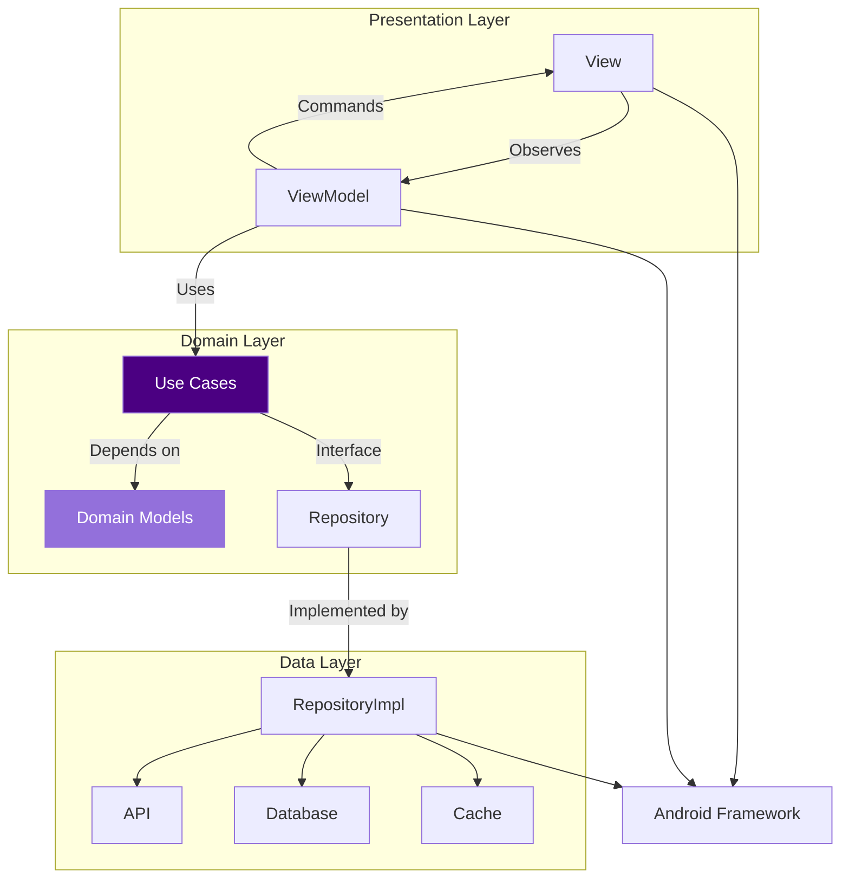
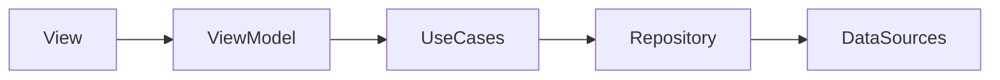

# Domain-MVVM-
Personal notes
# 🌌 MVVM Architecture: A Galactic Guide for the domain layer. Follow this starship analogy!



## 🚀 Core Components

### 1. **View (Starfighter Cockpit)**
- **Mission**: UI voews rendering & user interactions
- **Tech**: Android Components (Activities/Fragments/Compose/Drawables/MaterialTheme(s)...)
- **Rules**:
  - Zero business logic 
  - Observe ViewModel's LiveData/StateFlow
  - Handle UI events by calling ViewModel methods

```kotlin
class StarshipActivity : AppCompatActivity() {
    private val viewModel: StarshipViewModel by viewModels()
    
    override fun onCreate() {
        viewModel.warpDriveStatus.observe(this) { status ->
            updateWarpDisplay(status)
        }
        
        bindButton.setOnClickListener {
            viewModel.engageHyperdrive()
        }
    }
}
```

### 2. **ViewModel (Starship Computer)**
- **Mission**: UI logic & state management
- **Tech**: Jetpack ViewModel + Coroutines/Flow
- **Rules**:
  - Survives configuration changes
  - Never references Android Context
  - Delegates business logic to Use Cases

```kotlin
class StarshipViewModel(
    private val hyperdriveUseCase: HyperdriveUseCase
) : ViewModel() {
    private val _warpStatus = MutableStateFlow<WarpStatus>(Idle)
    val warpDriveStatus: StateFlow<WarpStatus> = _warpStatus.asStateFlow()

    fun engageHyperdrive() {
        viewModelScope.launch {
            _warpStatus.value = Engaging
            hyperdriveUseCase().collect { status ->
                _warpStatus.value = status
            }
        }
    }
}
```

### 3. **Domain Layer (The Force thrusting starship)**
- **Mission**: Pure business logic & rules
- **Contains**:
  - **Use Cases** (Business operations)
  - **Domain Models** (Business entities)
  - **Repository Interfaces** (Contracts)
- **Golden Rule**: Zero Android dependencies!

```kotlin
// Domain Model
data class Starship(
    val id: String,
    val name: String,
    val warpCapability: WarpFactor
)

// Use Case
class CalculateWarpUseCase {
    operator fun invoke(distance: LightYears): WarpFactor {
        return when {
            distance > 10 -> WarpFactor.NINE
            distance > 5 -> WarpFactor.EIGHT
            else -> WarpFactor.SEVEN
        }
    }
}

// Repository Contract
interface DilithiumRepository {
    suspend fun harvestCrystals(): List<Dilithium>
}
```

### 4. **Data Layer (Engineering Deck: Things should go right here)**
- **Mission**: Data operations & implementation
- **Contains**:
  - Repository implementations
  - Data sources (API, DB, Cache)
  - Data Transfer Objects (DTOs)
- **Key Task**: Map DTOs ↔ Domain Models

```kotlin
class DilithiumRepositoryImpl(
    private val api: KlingonApi,
    private val db: CrystalDatabase
) : DilithiumRepository {
    
    override suspend fun harvestCrystals(): List<Dilithium> {
        return api.getCrystals().map { it.toDomain() }
    }
    
    private fun CrystalDto.toDomain(): Dilithium {
        return Dilithium(
            purity = this.purityLevel,
            energyOutput = this.terawatts * 1.21 // Gigawatts conversion
        )
    }
}
```

## ⚡ Dependency Flow


## 💥 Why Domain Layer Rocks
1. **Pure Kotlin code** (No Android dependencies!)
2. **Layer is testable without Robolectric**
3. **Business rules stay decoupled** from framework
4. **Single source of truth** for core logic
5. **Survives UI/Data layer rewrites**

## 🛠️ Pro Tips for Jedi Masters
- **ViewModels**: Should delegate to Use Cases, not directly to Repositories
- **DI**: Use Hilt/Koin to inject dependencies. Koin is relatively stable IMO.
- **Threading**: Use coroutines with `viewModelScope`/`lifecycleScope`
- **Testing**: 
  - Domain Layer: Pure JUnit tests
  - ViewModel: JUnit + Turbine/Coroutines Test
  - UI: Espresso/Compose UI tests

## 🔗 Recommended Reading
- [Android Architecture Blueprints](https://github.com/android/architecture-samples)
- [Guide to App Architecture](https://developer.android.com/topic/architecture)
- [Kotlin Flows in Practice](https://developer.android.com/kotlin/flow)

> "Good architecture is like dilithium crystals - invisible when everything works, catastrophic when it fails." - Scotty, USS Enterprise

May your code compile on the first try, InshaAllah! 🖖
